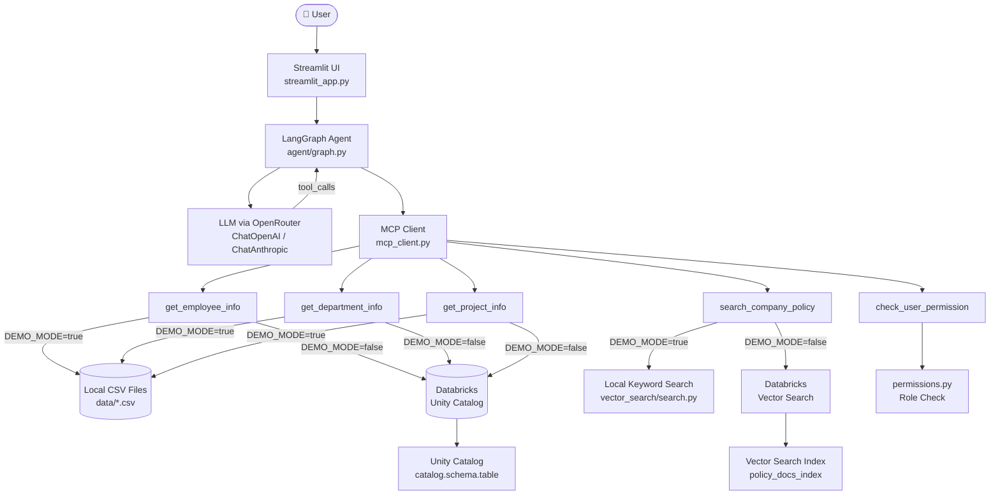
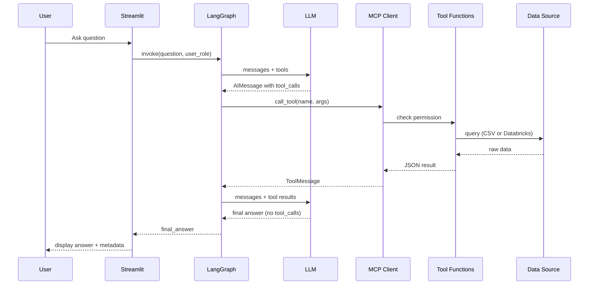
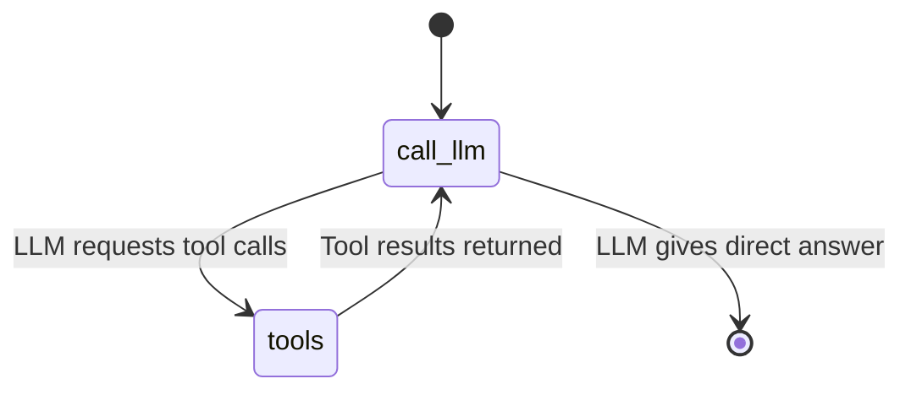

# Architecture — MCP Tool-Calling AI Agent

## Full System Architecture



## Data Flow for a Question



## LangGraph Workflow



## Permission Model

```
Application Level (mcp_server/permissions.py)
├── employee  → can call all 5 tools, sees limited fields
├── manager   → same as employee + sees access_level field
└── admin     → same as manager + all fields

Unity Catalog Level (Databricks, production)
├── employees-group   → SELECT on departments, projects
├── managers-group    → SELECT on employees
└── admin-group       → ALL on all tables

NOTE: Application-level checks control what the AI agent shows.
      Unity Catalog checks control what the database returns.
      Both layers must be configured for true enterprise security.
      Application checks alone are NOT sufficient for production.
```

## Component Map

| File | Purpose |
|---|---|
| `streamlit_app.py` | Web UI |
| `app.py` | CLI interface |
| `mcp_client.py` | MCP tool registry + dispatcher |
| `agent/graph.py` | LangGraph graph builder |
| `agent/state.py` | Shared state schema |
| `agent/nodes.py` | LLM node + tool node |
| `agent/prompts.py` | System prompts |
| `mcp_server/server.py` | MCP server (FastMCP/MCPServer) |
| `mcp_server/tools.py` | Data access functions (CSV + Databricks) |
| `mcp_server/permissions.py` | Role-based access control |
| `databricks/client.py` | Databricks connection management |
| `databricks/queries.py` | Parameterised SQL queries |
| `databricks/setup.sql` | Unity Catalog table setup |
| `vector_search/ingest.py` | Document chunking pipeline |
| `vector_search/search.py` | Keyword / Vector Search retrieval |
| `config.py` | Environment config loader |
